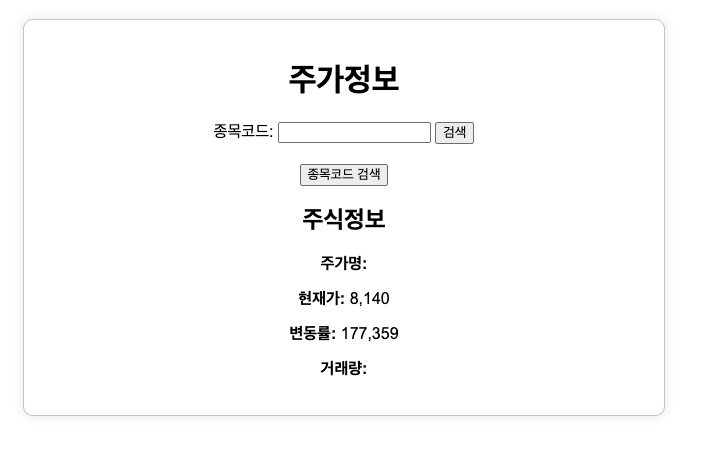

## 개요
> 주식종목코드를 입력하면 거래량, 변동률, 현재가, 주가명을 보여주는 편리한 웹 사이트입니다.

> Python web 크롤링으로 제작하였으며, 기본적인 html, css 넣어 제작하였습니다.

> 주식종목코드를 쉽게 검색할 수 있도록 종목코드 검색링크도 첨부하였습니다.

### 메인화면

### 종목코드 검색시 노출화면

## 빌드환경
* Pycharm 3.12 이상
* Flask
* Request
* BeautifulSoup
  

## 테스트환경
* Mac / Window 10 이상
